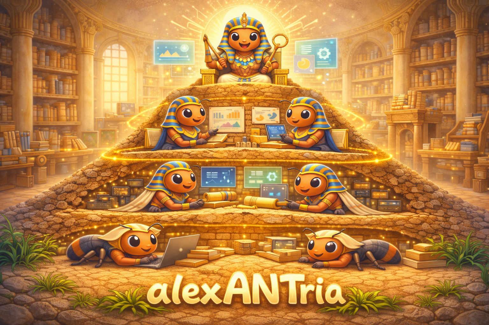

# alexANTria

**A model of intelligence based on coordination, not command.**



---

## 📝 Latest: Guardrails for Gas Town

**Can you run 30 agents without burning down production?**

Steve Yegge's Gas Town proved you can orchestrate chaos and still ship. But even at Stage 8—swarming 30 agents with perfect work coordination—he hit every context problem: plan dementia, re-explanations, becoming the bottleneck.

**The insight:** Work memory ≠ context memory.

Orchestrators like Gas Town coordinate *what* to do. Issue trackers like Beads track dependencies and status. But when 20 agents need to know *how you work*—your conventions, constraints, architectural decisions—that knowledge needs somewhere persistent to live.

**Read the full post:** [Guardrails for Gas Town: Why Orchestration Needs Context Infrastructure](./BLOG-gastown-context-infrastructure.md)

**Key claim:** "Context infrastructure isn't about writing artisanal code. It's about not letting chaos become catastrophic."

*This is a living document (v0.1.0). We're documenting what we're learning as we build. [Help us figure it out](https://github.com/hoop71/alexANTria/discussions).*

---

## Philosophy

Intelligence does not come from a single, all-knowing agent.
It emerges from many small, well-scoped actions operating over shared context.

alexANTria treats documentation as **living memory**:

- not static instructions,
- not one-off prompts,
- but shared state that must be read, used, and maintained.

Like an ant colony, the system works because:

- each action is local,
- each contribution is small,
- and the shared map is continuously repaired.

## What is alexANTria?

A **universal organizational knowledge framework** that scales from solo developers to large teams.

**Not just for coding agents.** Started as context infrastructure for AI assistants, discovered it's a broader pattern for organizational alignment.

**Not tied to Claude.** Currently implemented on Claude Code, designed to work with any platform. See [ANT-PLATFORM-INTERFACE.md](./ANT-PLATFORM-INTERFACE.md).

**Not just for Gas Town.** Agent swarms prove the need, but the pattern applies from 1 agent to 30+ agents to human-only teams.

## The Problem

**Every coding session starts from scratch.**

You're working with Claude Code (or Cursor, or Windsurf). You explain your architecture. You describe your conventions. The session compacts. You start over. You explain it again.

Tomorrow, a teammate asks their coding assistant the same questions. Yesterday's explanations are gone.

Next week, you switch to a different part of the codebase. You repeat yourself about auth patterns, testing conventions, why the database is structured this way.

**The pain:**

- **Context lives in your head** — Every session, every teammate, every area of the codebase: you're the oracle
- **Explanations don't persist** — What you told Claude yesterday is gone after compaction
- **Documentation goes stale** — You write docs once, they drift, nobody maintains them
- **No shared understanding** — Your assistant makes one choice, your teammate's makes another

This gets worse as you:
- Work on larger codebases
- Collaborate with teammates
- Run multiple sessions (frontend + backend + tests)
- Try to scale to agent swarms or orchestrators

**The root problem:** Context is the bottleneck. Your coding assistants need to know *how you work*—your architectural decisions, your constraints, your "why"—but that knowledge has nowhere persistent to live.

## The Solution

**alexANTria is living memory for your codebase.**

Think of it as the shared map your coding assistants walk on. Instead of re-explaining your architecture every session, your documentation becomes persistent context that:

- **Survives sessions** — Explanations persist across compactions, restarts, tomorrow's work
- **Layers with precedence** — Philosophy overrides implementation; constraints guide decisions
- **Evolves with your code** — Assistants read it, use it, and help maintain it
- **Works solo or at scale** — One developer with one assistant, or teams with orchestrated swarms

**Agents leave trails. Trails fade. Trails get reinforced.**

Just as ant colonies navigate via pheromone trails—chemical markers that persist and require maintenance—your coding assistants need institutional memory that outlives any individual session.

**What you get:**

| Before | After |
|--------|-------|
| "Let me explain our auth approach again..." | Your assistant reads the persistent context |
| Context bloats every prompt (5,000+ tokens) | Shared infrastructure, assistants load what's relevant |
| Your teammate's assistant contradicts yours | Shared understanding across all sessions |
| Documentation rots | Living memory, maintained as you work (with discipline) |
| Scales to 3 assistants, then hits a wall | Most effective at 5-30 assistants; patterns under exploration for larger swarms |

**This isn't about writing artisanal code. It's about not repeating yourself.**

Whether you're solo with a few Claude sessions, or scaling to orchestrated swarms, alexANTria provides shared context infrastructure. We're learning what works at each stage.

## Core Principles

### 1. Context is load-bearing

Documentation is not optional. It is the substrate intelligence walks on.
If context is wrong or stale, behavior will be wrong.

### 2. Read, then act — then repair

Every action assumes existing context.
If an action changes reality, the context must change too.

### 3. Small actions scale

No single change needs to be perfect.
Consistency emerges from accumulation, not authority.

### 4. No central brain

There is no master prompt, no god agent.
Alignment comes from shared constraints, not top-down control.

### 5. History matters

Past decisions are not clutter.
They explain why the system looks the way it does.

## What alexANTria Rejects

- **One-shot intelligence** — context must persist
- **Hidden state** — if it matters, it's documented
- **Orphaned documentation** — docs that no one reads or maintains
- **"Magic" behavior** — every action traceable to context

If a system acts without updating shared memory, it is drifting.

## Naming Convention

Everything in the colony follows the `ANT-*` or `ant-*` naming pattern:

| Type                | Pattern        | Examples                            |
| ------------------- | -------------- | ----------------------------------- |
| **Conceptual docs** | `ANT-*.md`     | `ANT-SCHEMA.md`, `ANT-FRAMEWORK.md` |
| **Commands**        | `ant-*`        | `/ant-init`, `/ant-update`          |
| **State directory** | `.alexantria/` | `.alexantria/manifest.json`         |

**Exception:** `README.md` stays as-is (GitHub convention for discoverability).

This makes alexANTria files immediately recognizable in any project.

---

## The Structure

alexANTria gives your coding agents (Claude Code, Cursor, etc.) a shared map to walk on. Instead of re-explaining your architecture every session, your docs become the living memory that agents read automatically.

```
Your Project
├── CLAUDE.md                    # Entry point — the colony's pheromone trail
├── .alexantria/                 # Colony state (ant-* pattern)
│   ├── manifest.json            # Worker ant tracking
│   └── pending.log              # Commits awaiting processing
├── .claude/rules/               # Auto-loaded context by file path
│   ├── frontend.md
│   ├── backend.md
│   └── ...
├── docs/                        # Your existing docs (any naming)
│   ├── philosophy.md            # Layer 1: Non-negotiables
│   ├── product-brief.md         # Layer 2: What we're building
│   └── ...
└── ARCHITECTURE.md              # Layer 3: How we build
```

**What's alexANTria vs. yours:** The `.alexantria/` directory and its contents follow the `ant-*` naming pattern. Your existing docs (`philosophy.md`, `ARCHITECTURE.md`, etc.) keep their original names — `/ant-init` discovers and maps them, it doesn't rename them.

When an agent opens a file in `src/components/`, it automatically loads `frontend.md` which points to your design philosophy. The agent works within your constraints without you having to repeat them.

See [ANT-SCHEMA.md](./ANT-SCHEMA.md) for the full nesting pattern.

## The Behavior Loop

Every agent action follows the same pattern:

1. **Read** — Identify the area, load relevant docs from the hierarchy
2. **Act** — Implement with context, decisions align with documented constraints
3. **Repair** — If the change affects higher-level docs, update them

This is how the colony maintains its map. No single agent needs to understand everything. Each one reads what's relevant, acts locally, and repairs what it touched.

## Document Hierarchy

Documentation forms layers. Each layer builds on the previous, and outer layers constrain inner ones:

```
Philosophy/Constraints  ← Overrides everything below
    ↓
Product/Business Rules  ← Informs features
    ↓
Technical Patterns      ← Guides implementation
    ↓
Changelog/History       ← Records decisions (history matters)
```

When you change something at a lower level that affects a higher level, repair the upstream doc.

## Quick Start

### 1. Fork & Clone

```bash
# Fork this repo on GitHub first, then:
git clone https://github.com/hoop71/alexANTria
cd alexANTria
```

### 2. Customize (optional but recommended)

Before installing, review and edit:

- `user-level/CLAUDE.md` — Your universal philosophy for all projects
- `user-level/commands/ant-init.md` — How project scaffolding works
- `user-level/commands/ant-update.md` — Worker ant post-commit updates
- `templates/` — Starting points for project-level docs

Delete what doesn't fit your workflow. Add what's missing.

### 3. Install

```bash
./install.sh
```

This copies your customized files to `~/.claude/`:

- Universal philosophy (applies to all your projects)
- `/ant-init` command to scaffold new projects

### 4. Set Up a Project

```bash
cd /path/to/your/project
```

Then run:

```
/ant-init
```

The agent will:

1. **Crawl** — Find existing markdown files and code directories
2. **Classify** — Map docs to the hierarchy (philosophy → product → architecture → implementation)
3. **Propose** — Show you the mapping and ask for confirmation
4. **Generate** — Create `CLAUDE.md` and `.claude/rules/` based on what exists

The command discovers what you have rather than asking you to describe it.

## What Gets Installed

### User-Level (`~/.claude/`)

```
~/.claude/
├── CLAUDE.md              # Universal "read, act, repair" philosophy
└── commands/
    ├── ant-init.md        # Scaffolds project structure
    └── ant-update.md      # Worker ant: processes pending commits
```

### Project-Level (after `/ant-init`)

```
your-project/
├── CLAUDE.md              # Doc hierarchy + "when to read" table
├── .claude/
│   └── rules/
│       ├── frontend.md    # Auto-loads for src/components/**
│       ├── backend.md     # Auto-loads for src/server/**
│       └── ...
├── .alexantria/
│   ├── manifest.json      # Worker ant tracking
│   └── pending.log        # Pending commits (from git hook)
└── .git/hooks/
    └── post-commit        # Records commits for worker ants
```

## How It Works

### Automatic Context Loading

Rules in `.claude/rules/` have path matchers:

```markdown
---
paths:
  - 'src/components/**/*.tsx'
  - 'src/routes/**/*.tsx'
---

# Frontend Context

Before modifying UI, read:

- [ux-philosophy.md](../../docs/ux-philosophy.md)
```

When you edit a file matching those paths, the rule auto-loads. The agent walks on the right substrate automatically.

### Doc Hierarchy in CLAUDE.md

Your project's CLAUDE.md tells the agent what to read and when:

```markdown
## When to Read

| Working on...   | Read first                                  |
| --------------- | ------------------------------------------- |
| UI/UX decisions | [ux-philosophy.md](./docs/ux-philosophy.md) |
| Product scope   | [product-brief.md](./docs/product-brief.md) |
| Implementation  | [ARCHITECTURE.md](./ARCHITECTURE.md)        |

## When to Repair

After completing work that affects:

- Design patterns → update ux-philosophy.md
- Product scope → update product-brief.md
- Technical patterns → update ARCHITECTURE.md
```

### The Repair Loop

After completing work, the agent checks:

- "Did I change a **UX pattern**? → Should we update the constraints doc?"
- "Did I change **product scope**? → Should we update the product doc?"
- "Did I add **technical patterns**? → Should we update architecture?"

This keeps the map accurate. Small repairs accumulate into coherent documentation.

## Templates

The `templates/` directory contains starting points you can customize:

| Template                     | Purpose                 |
| ---------------------------- | ----------------------- |
| `CLAUDE.md.template`         | Doc hierarchy structure |
| `rules/frontend.md.template` | UI component rules      |
| `rules/backend.md.template`  | Server/API rules        |
| `rules/ai.md.template`       | AI/LLM agent rules      |

## Growing the Anthill

Every anthill starts as a small mound. Stack layers as the colony grows:

```
                    ╱╲
                   ╱  ╲
                  ╱ 👑 ╲
                 ╱QUEEN ╲            ← Strategic alignment
                ╱────────╲
               ╱   NEST   ╲          ← Org-wide views
              ╱────────────╲
             ╱   CHAMBERS   ╲        ← Cross-cutting patterns
            ╱────────────────╲
           ╱     TUNNELS      ╲      ← Service connections
          ╱────────────────────╲
         ╱       SURFACE        ╲    ← Start here
        ╱────────────────────────╲
═══════════════════════════════════════
              🌱 ground 🌱
```

| Layer           | What Lives Here                        | When to Build         |
| --------------- | -------------------------------------- | --------------------- |
| 🌱 **Surface**  | Raw docs from individual services      | Start here            |
| 🚇 **Tunnels**  | Architecture, API flows                | When services connect |
| 🏛️ **Chambers** | Cross-service insights                 | Patterns emerge       |
| 🐜 **Nest**     | Audience-specific views (eng, product) | Stakeholders diverge  |
| 👑 **Queen**    | Executive strategic analysis           | Vision gaps matter    |

See [ANT-SCHEMA.md](./ANT-SCHEMA.md) for the full pattern.

## Bring Your Own

alexANTria is designed for customization:

- **Templates** — Edit `templates/` before install to change what gets generated
- **Rules** — Add new `templates/rules/*.template` for your domains (data layer, infra, security)
- **Commands** — Modify `user-level/commands/ant-init.md` to change the scaffolding workflow
- **Philosophy** — Edit `user-level/CLAUDE.md` to change how agents approach all your projects

See [templates/README.md](./templates/README.md) for customization details.

## Worker Ants

The `/ant-update` command spawns a worker ant that keeps surface docs in sync.

**The flow:**

```
You commit (manually or via agent)
        ↓
Git hook records it to .alexantria/pending.log
        ↓
Next time you run /ant-update
        ↓
Worker ant processes all pending commits
        ↓
Updates local READMEs if needed
        ↓
Clears the pending log
```

**Why this pattern?**

- Manual commits get tracked (git hook is fast, no Claude needed)
- Agent commits get tracked too
- No expensive Claude spawning on every commit
- Worker ant catches up in batches

**The pending log** is simple: `TIMESTAMP|HASH|MESSAGE` per line. No dependencies, pure bash.

**The manifest** (`.alexantria/manifest.json`) tracks what the worker ant has processed—your paper trail for future "phone home" syncing to higher-level docs.

## Other Coding Agents

The pattern works with any agent that reads markdown:

- **Cursor** — Use `.cursorrules` or project-level instructions
- **GitHub Copilot** — Use `.github/copilot-instructions.md`
- **Windsurf** — Use project rules
- **Aider** — Use conventions files

The living memory pattern (layered docs + path-specific rules) transfers. Only the hook mechanism differs.

## Beyond Coding Agents

Coding agents are just one type of worker in the colony. The same structure that helps agents understand your code can help your entire organization share knowledge.

Product managers reading strategy docs, engineers reviewing architecture, executives tracking platform health—these are all context engines consuming knowledge at different layers.

The scaffolding you set up for coding agents becomes the foundation for org-wide knowledge:

- Start with **surface** documentation for your agents
- Add **tunnels** when services connect
- Add **chambers** when cross-cutting patterns emerge
- Add **nest** views when stakeholders need different perspectives
- Add **queen** synthesis when strategic alignment matters

See [ANT-FRAMEWORK.md](./ANT-FRAMEWORK.md) for the full organizational knowledge framework.

---

## The Goal

alexANTria exists to make intelligence **maintainable**.

Not smarter in isolation.
Smarter over time.
Through coordination, not command.

---

## License

MIT
