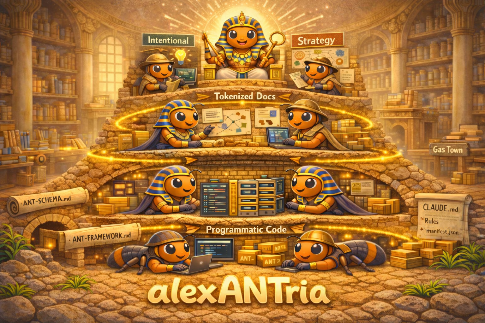

# alexANTria

**RLM architecture for project-scale context.** Prevent context rot with three-pool documentation: what agents can infer (code), what must be written (patterns), what only humans know (strategy).



---

## The Problem

Every session starts from scratch. You re-explain architecture, context bloats (5K+ tokens), docs rot, agents contradict each other.

**Context rot is structural** — models degrade beyond soft limits, even within the window. Compounds with teams and swarms.

---

## The Solution

**Three-pool RLM architecture:**

1. **Programmatic** (code) — Agents infer from implementations
2. **Tokenized** (docs) — Patterns that must be written
3. **Intentional** (strategy) — Human knowledge: why decisions were made

**Result:** Layered auto-loading memory that survives sessions, evolves with code, scales from solo → teams → swarms.

[The Potential of RLMs](https://www.dbreunig.com/2026/02/09/the-potential-of-rlms.html)

---

## Proof

Automated self-tests validate selective loading. **[RLM-VALIDATION-PROOF.md](./RLM-VALIDATION-PROOF.md)**

- 🎯 **14.8x context reduction** (317.7 KB → 21.3 KB)
- 📊 **93.3% unloaded** (only needed docs enter attention)
- 💰 **75,871 tokens saved**

Run: `/ant-validate-rlm`

---

## Install

```bash
curl -fsSL https://raw.githubusercontent.com/hoop71/alexANTria/main/install.sh | bash
# Restart Claude Code
cd your-project/ && /ant-init
```

**Teams:** Each dev installs commands. Project structure in git. Fork for custom commands.

---

## Local-Only Mode

Test privately before sharing with your team:

```bash
/ant-init  # Choose "Local-only"
# All features work, files gitignored
/ant-publish  # When ready to share (one-way)
```

Perfect for pilots, proving value, or clean exit if it doesn't work.

---

## What You Get

```
your-project/
├── CLAUDE.md           # Hierarchy map
├── .claude/rules/      # Auto-loads by path
│   ├── frontend.md     # Loads for src/components/**
│   └── backend.md      # Loads for src/server/**
└── .alexantria/       # Tracking
    └── manifest.json
```

Edit `src/components/Button.tsx` → auto-loads `frontend.md` → points to design philosophy → agents work within constraints.

**Drop-in:** Only updates files it owns (`ANT-*`, `.alexantria/`). Your docs untouched. Safe to test, easy to remove.

### Graduation

ANT-* files graduate to native files when ready:

```
ANT-STRATEGY.md → STRATEGY.md
ANT-PRODUCT.md  → PRODUCT.md
ANT-PATTERNS.md → PATTERNS.md
...
```

**Flow:** Pilot (coexist) → Active (validate) → Graduate (`/ant-graduate`) → Full (maintain native)

---

## Commands

- `/ant-init` — Scaffold structure
- `/ant-update` — Update docs
- `/ant-validate` — Check health

Pattern: Read → Act → Repair

---

## Docs

- **[RLM-ARCHITECTURE.md](./RLM-ARCHITECTURE.md)** — Three-pool architecture, prevents context rot
- **[CLAUDE.md](./CLAUDE.md)** — Hierarchy map
- **[ANT-FRAMEWORK.md](./ANT-FRAMEWORK.md)** — Coordination model
- **[ANT-SCHEMA.md](./ANT-SCHEMA.md)** — 3-level pattern
- **[blog/gastown-context-infrastructure.md](./blog/gastown-context-infrastructure.md)** — Why swarms need context

---

## Principles

1. **Context is load-bearing** — Wrong context = wrong behavior
2. **Read, act, repair** — Actions assume context; reality changes context
3. **Small actions scale** — Consistency from accumulation, not authority
4. **No central brain** — Alignment from shared constraints
5. **History matters** — Past decisions explain present state

---

## Customization

Fork for custom commands, team templates, or new `/ant-*` commands. Otherwise install from upstream.

See `user-level/` and `templates/`.

---

## Platform

Claude Code implementation. Pattern works with any markdown-reading agent (Cursor, Copilot, Windsurf, Aider). Also for org knowledge management.

---

## License

MIT

---

*v0.1.0 — Living document. [Help us figure it out](https://github.com/hoop71/alexANTria/discussions).*
